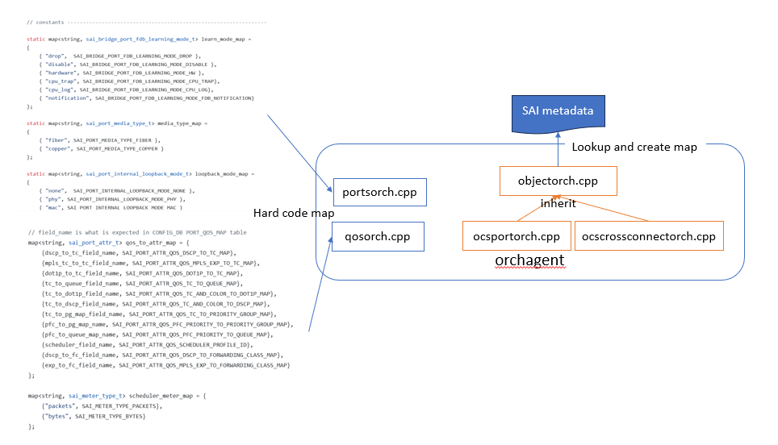
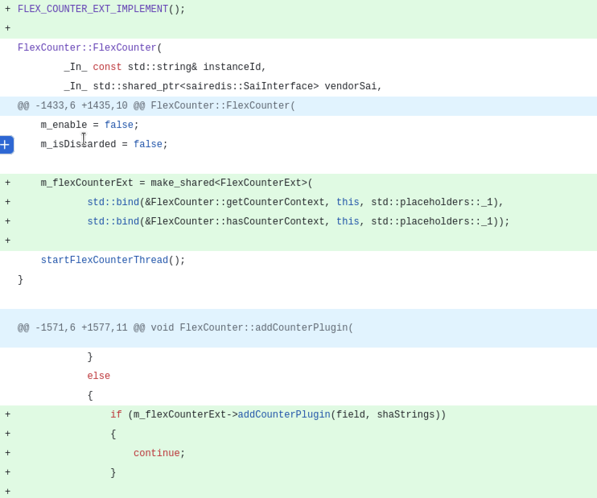

# SONiC-OCS HLD

This document comply to [SONiC HLD Template](https://github.com/sonic-net/SONiC/blob/master/doc/hld_template.md). It will be evolved in parallel with the on-going prototyping, an OCS device as kvm virtual machine.

- Here is the the implementation of [OCS kvm](https://github.com/sonic-molex/sonic-buildimage/tree/ocs).
- The compile and running instruction for OCS kvm is described in the [README.md](https://github.com/sonic-molex/sonic-buildimage/blob/ocs/platform/ocs-kvm/README.md) here.

## Table of Contents

- [SONiC-OCS HLD](#sonic-ocs-hld)
  - [Table of Contents](#table-of-contents)
  - [1 Revision](#1-revision)
  - [2 Scope](#2-scope)
  - [3 Definitions/Abbreviations](#3-definitionsabbreviations)
    - [Table 1: Abbreviations](#table-1-abbreviations)
  - [4 Overview](#4-overview)
  - [5 Requirements](#5-requirements)
    - [5.1 Functional requirements](#51-functional-requirements)
    - [5.2 Scaling requirements](#52-scaling-requirements)
    - [5.3 Alarm](#53-alarm)
    - [5.4 PM Counter](#54-pm-counter)
    - [5.5 Telemetry](#55-telemetry)
  - [6 Architecture Design](#6-architecture-design)
    - [6.1 Design Principles](#61-design-principles)
    - [6.2 SONiC Extension Points for OCS Support](#62-sonic-extension-points-for-ocs-support)
  - [7 High-Level/Module Design](#7-high-levelmodule-design)
    - [7.1 OCS Device Metadata](#71-ocs-device-metadata)
    - [7.2 SWSS Extension for OCS Optical Traffic](#72-swss-extension-for-ocs-optical-traffic)
      - [7.2.1 SWSS Config Manager](#721-swss-config-manager)
      - [7.2.2 SWSS orchagent](#722-swss-orchagent)
        - [OrchDaemon for OCS](#orchdaemon-for-ocs)
        - [Generic orchagent Class](#generic-orchagent-class)
    - [7.3 OCS State and PM Statistics Support](#73-ocs-state-and-pm-statistics-support)
      - [7.3.1 SONiC SWSS Redis plug-in script](#731-sonic-swss-redis-plug-in-script)
      - [7.3.2 State DB and PM counter update](#732-state-db-and-pm-counter-update)
      - [7.3.3 Device specific lua script example](#733-device-specific-lua-script-example)
    - [7.4 SyncD Extension](#74-syncd-extension)
    - [7.5 PMON](#75-pmon)
      - [7.5.1 PMON Base Class](#751-pmon-base-class)
      - [7.5.2  Device specific platform config and driver](#752--device-specific-platform-config-and-driver)
      - [7.5.3 Linecard Hot-pluggable](#753-linecard-hot-pluggable)
      - [7.5.4 Firmware Upgrade](#754-firmware-upgrade)
    - [7.6 SONiC host containers](#76-sonic-host-containers)
  - [8. SAI API](#8-sai-api)
    - [8.1 SAI Experimental Extension Mechanism](#81-sai-experimental-extension-mechanism)
    - [8.2 OCS Extension To SAI](#82-ocs-extension-to-sai)
  - [9. Configuration and management](#9-configuration-and-management)
    - [9.1. Manifest (if the feature is an Application Extension)](#91-manifest-if-the-feature-is-an-application-extension)
    - [9.2. CLI/YANG model Enhancements](#92-cliyang-model-enhancements)
      - [9.2.1 OCS SONiC Yang Model](#921-ocs-sonic-yang-model)
      - [9.2.2 CLI](#922-cli)
      - [9.2.3 REST API](#923-rest-api)
    - [9.3. Config DB Enhancements](#93-config-db-enhancements)
    - [9.4 Reuse Exsiting Features](#94-reuse-exsiting-features)
      - [9.4.1 Management and Loopback Interface](#941-management-and-loopback-interface)
      - [9.4.2 TACACS+ AAA](#942-tacacs-aaa)
      - [9.4.3 Syslog](#943-syslog)
      - [9.4.4 NTP](#944-ntp)
      - [9.4.5 Telemetry and gNMI](#945-telemetry-and-gnmi)
      - [9.4.6 SONiC Management Framework](#946-sonic-management-framework)
      - [9.4.7 SONiC upgrade](#947-sonic-upgrade)
  - [10. Warmboot and Fastboot Design Impact](#10-warmboot-and-fastboot-design-impact)
  - [11. Memory Consumption](#11-memory-consumption)
  - [12. Restrictions/Limitations](#12-restrictionslimitations)
  - [13. Testing Requirements/Design  (**TBD**)](#13-testing-requirementsdesign--tbd)
    - [13.1. Unit Test cases](#131-unit-test-cases)
    - [13.2. System Test cases](#132-system-test-cases)
  - [14. Open/Action items - if any](#14-openaction-items---if-any)

## 1 Revision

|  Rev  |    Date    |       Author        | Change Description                        |
| :---: | :--------: | :-----------------: | :---------------------------------------- |
|  0.1  | 06/30/2025 |    Jimmy Jin, Lu Mao   | Initial version, Some portion is derived from [sonic-otn-wp](https://github.com/sonic-otn/SONiC-OTN)|

## 2 Scope

This document describes the architecture and high level design for extending SONiC to support Optical Circuit Switch (OCS) device.

## 3 Definitions/Abbreviations

### Table 1: Abbreviations

|       |                                                    |
| ----- | --------------------------------------------------- |
|OCS   | Optical circuit switch         |
|NOS   | Network operating system           |
|SA    | Service affect     |
|NSA    | Non service affect    |
|PM     | Performance management   |
|OTAI  | Optical transport abstraction interface |
|DCI   | Inter data center connection  |

## 4 Overview

Optical circuit switch (OCS), also known as an all-optical switch, is a technology that establishes optical connections between fibers, allowing data transmission without the need for electrical switching and conversion (OEO). Here are some advantages of OCS comparing to the electrical switches:

- Improved Performance:
OCS can offer lower latency and higher throughput. This is because OCS operates at the physical layer, directly switching light signals rather than processing electrical packets.
- Scalability:
OCS can be used to create large-scale, reconfigurable networks without the limitations of traditional electrical switches.
- Reduced Energy Consumption:
OCS consumes less power than EPS, leading to significant energy savings in large data centers.
- Reconfigurable Topologies:
OCS enables the creation of dynamic, logical topologies that can be adapted to changing communication patterns.
- Failure Resilience:
OCS can provide alternative paths for data transmission, improving network resilience.

As such, OCS can be used a various network use cases. One of the main application of OCS is to connect large number of AI computing nodes to form a AI super computing cluster, as shown in the following diagram [(source):](https://arxiv.org/pdf/2304.01433)

  

Another OCS use case is to provide low power consumption and low latency inter data center connections (DCI), shown in the following diagram:[(source):](https://www.microsoft.com/en-us/research/publication/beyond-the-mega-data-center-networking-multi-data-center-regions/)

  

This document provides high level design of extending SONiC to support OCS device, including yang model, SAI APIs, orchestration agent, syncd, Config and APP DB Schemas and other SONiC changes required to bring up SONiC image on an OCS device.

## 5 Requirements

### 5.1 Functional requirements

At a high level the following should be supported:

- Bring up SONiC image for DEVICE_METADATA type - `SonicOCS`
- Bring up swss/syncd containers for switch_type - `ocs`
- Able to manage OCS device configured via REST, gRPC client and CLI
- Device Management functions including:
  - Configuration - system, OCS port and OCS cross-connect.
  - State report - system, OCS port and OCS cross-connect.
  - Operations: restart (warm, cold and power-on), SW/FW upgrade
  - Telemetry: Data streaming for time sensitive state.
  - Alarm notification for system faults.
  - PM statistics counters for important performance parameters.

The OCS deployment and device management in a data center for AI application is illustrated in the following diagram:

  

### 5.2 Scaling requirements

Following are the scaling requirements: [*TBD*]

| Item                          | Expected Max value                |
| ----------------------------- | ----------------------------- |
| Ports                         | 2x1024                        |
| Cross-connect                | 1024           |

### 5.3 Alarm

Alarms that listed in the following table should be supported:**[TBD]**

| Alarm name                          | Severity                |  
| ----------------------------- |-----------------------------------|
| Port-failed              | SA                         |
| PUS Failed               | NAS        |

### 5.4 PM Counter

Network equipment performance management counters are metrics that monitor and provide insights into the performance of network devices. They help identify potential issues, bottlenecks, and areas for optimization, enabling network administrators to proactively manage and troubleshoot their infrastructure:

For each PM parameters, the following statistics should be available for users:

- 96 (32) buckets of 15-minute counters including min, max and average.
- 7 bucket of 24-hour counters with min, max and average.

PM parameters that listed in the following table should be supported:**[TBD]**

| PM name                          | Data Type                |  
| ----------------------------- |-----------------------------------|
| Temperature              | decimal2                         |
| PUS Input Current               | decimal2        |
| Fan Speed               | int32        |

### 5.5 Telemetry

OCS should support telemetry features. Both [dial-in](https://github.com/sonic-net/sonic-telemetry/blob/master/doc/grpc_telemetry.md) and [dial-out](https://github.com/sonic-net/sonic-telemetry/blob/master/doc/dialout.md) modes for telemetry should be supported.

## 6 Architecture Design

This section describes the overall changes needed for supporting OCS devices.

### 6.1 Design Principles

While SONiC is a packet switch NOS, it's modular design and built-in extensibility infrastructure allow developers to add functionality beyond the packet switching domain.

The following guideline should be followed while developing SONiC based NOS for OCS.

- Fully utilize SONiC rich extension mechanism to make the change as seamless as possible so that the OCS support becomes a organic part of the SONiC.

- Complete reuse SONiC generic system features as is, including NBI (REST, CLI, gNMI), telemetry, user management, syslog notification, SW/FW upgrade, chassis/PSU/LED/FAN/temperature management, etc.

- Changes for OCS support should be modular and relatively isolated from the packet switching logic with non/minimum impact on existing packet switching functions.

- For major feature gaps, such as PM, alarm and hot pluggable, enhancement design and implement should be in a generic way, not just for OCS.

- All changes should be compatible to the upstream SONiC code base and ready to be merged. The final goal is that all OCS vendors should be able to pull the official SONiC code and build SONiC OCS images for their devices.

### 6.2 SONiC Extension Points for OCS Support

The following diagram shows the main changes and extension points of SONiC to support OCS device:

  

1. Add OCS SONiC yang (sonic-ocs.yang) and support REST API and CLI.

2. Redis DB: Add new CONFIG, STATE and APP tables (ocs-port, cross-connect).

3. Config Manger: Add Config manager for port and connections.

4. Chassis Drivers: Add user and kernel drivers for Fan, PSU, LED and temperature sensors, FPGA.

5. SAI: Extend SAI to support OSC using SAI experimental extension mechanism.

6. SyncD: SyncD driver supporting extended OSC SAI attributes.

7. Platform and device: Add OCS as a new sonic platform ocs and new OCS device, supporting configurable port counts (16x16, 64x64 and 512x512 etc..).

8. ONIE: Create ONIE image for installing SONiC image on OCS devices, support secure boot.

## 7 High-Level/Module Design

This section describes changes at SONiC module level to support OCS devices.

### 7.1 OCS Device Metadata

In DEVICE meta data table, a new type, `SonicOCS`, and new switch_type, `ocs`, are added:

``` JSON
"DEVICE_METADATA": {
    "localhost": {
        "type": "SonicOCS",
        "switch_type": "ocs",
     }
}
```

see [code here](https://github.com/sonic-molex/sonic-buildimage/blob/ocs/device/molex/x86_64-ocs-kvm_x86_64-r0/ocs-metadata.json).

### 7.2 SWSS Extension for OCS Optical Traffic

Two SONiC build-in containers, swss and syncd, are at the core for providing data path control and monitoring, as shown in the following diagram:


#### 7.2.1 SWSS Config Manager

In SWSS container, a new config manager daemon, [`ocsmgrd`](https://github.com/sonic-molex/sonic-swss/blob/ocs/cfgmgr/ocsmgrd.cpp), is created to subscribe the changes in OCS tables in config DB. When config change is notified, OCS config manager update the corresponding tables in APP DB.

[**TBD**] How the failure is handled, if the config change does not pass the business logic validation? SONiC configuration is managed asynchronously, i.e., the config will be accepted and stored in config DB, even the low level/HW processing fails.

#### 7.2.2 SWSS orchagent

Orchagent is extended with a [separate folder](https://github.com/sonic-molex/sonic-swss/tree/ocs/orchagent/ocs) to support OCS devices.

##### OrchDaemon for OCS

Currently, SONiC support two types of Orch Daemon based on `switchType`, orchDaemon or fabricOrchDaemon. A new type of orchDaemon, OcsOrchDamon is added to support OCS devices. At run time, switchType == `ocs` is use to determine if [ocsOrchDaemon](https://github.com/sonic-molex/sonic-swss/blob/ocs/orchagent/ocs/ocsorchdaemon.cpp) should be created. please see code [code here](https://github.com/sonic-molex/sonic-swss/blob/ocs/orchagent/main.cpp).

``` c++
    if(switchType == "ocs")
    {
        create orchDaemon = make_shared<OcsOrchDaemon>;
    }
    else if (switchType != "fabric")
    {
        orchDaemon = make_shared<OrchDaemon>();
    }
    else
    {
        orchDaemon = make_shared<FabricOrchDaemon>();
    }
```

Creating new type of OrchDamon isolates OCS support from the existing logic, resulting in no impact on existing packet features.

##### Generic orchagent Class

A generic superclass, [`objectorch`](https://github.com/sonic-molex/sonic-swss/blob/ocs/orchagent/ocs/objectorch.cpp), is defined to support all operations (CRUD) the Flexcounter DB.

Instead of hard code all SAI object attributes in a static map table (current SONiC design pattern), the orchagent corresponding to each SAI object can re-use the generic methods in `objectorch` for State and Flexcounter DB access. Shown as in the following diagram, where the SAI attribute to string map are built generically by reading the SAI metadata.



This effectively removed many redundant code and eliminated human error from hard code.

### 7.3 OCS State and PM Statistics Support

This section describes how to support OCS state update in STATE DB and PM statistics Counters.

Current SONiC does not support traditional telecom performance management (PM) historical counters.

- 96 (32) buckets of 15-minute counters including min, max and average.
- 7 bucket of 24-hour counters with min, max and average.

(OTN syncd added historical data by modifying the syncd code base. This causes a code base diverge from the upstream code.)

Also, attributes specified in the state container of sonic-ocs.yang need to be updated continuously, so that NBI (CLI/REST API) can read the OCS status from State DB directly.

#### 7.3.1 SONiC SWSS Redis plug-in script

SWSS utilizes Lua scripts for certain operations, particularly within its Producer/Consumer Table framework. These scripts help in atomically writing and reading messages to and from Redis databases.
Examples of Lua scripts within the SWSS can be found in the sonic-swss repository. One notable example is [pfc_restore.](https://github.com/sonic-net/sonic-swss/blob/master/orchagent/pfc_restore.lua), which uses Redis commands to handle PFC (Priority Flow Control) restoration.

#### 7.3.2 State DB and PM counter update

It is proposed to use SWSS lua script to support State DB update and PM statistic counters with the following benefits:

- Use existing counter DB as is. SONiC counter DB is designed for storing raw data from the hardware. Syncd updates the counters specified in the Flex-counter DB. Both State and PM counters can be built form the tables in counter DB
- Use SWSS orchagent existing mechanism to install lua scrips, which are similar to stored procedure in traditional database systems.These scripts are running inside of redis container and can be invoked whenever the counter DB is updated.
- These lua scripts can be device specific, i.e., each device vendor can write customized scripts and include as part of the device data. This provides the maximum flexibility and make status update and PM complete generic.
  
The following diagram shows the work flow of redis plug-in script in SONiC.


- First orchagent install the script as hashed SHA.
- When syncd add the counter attribute, it also add the plug-in SHA.
- When vendor SAI updates the counters, it also send request to redis DB to run the script.

The main advantage of this approach:

- No SONiC code need to be written for PM support
- Scripts is plugged in at device level, providing flexibility for each vendor to customize the behavior.

#### 7.3.3 Device specific lua script example

Here is the flex-counter DB and counter DB after script is installed for update the state DB. [example](https://github.com/sonic-molex/sonic-buildimage/tree/ocs/device/molex/x86_64-ocs-kvm_x86_64-r0)

Note currently, some vendor specific lua scripts are put into in the SWSS [orchagent](https://github.com/sonic-net/sonic-swss/blob/master/orchagent), which is not ideal. They could be included as part of device config, as above example.

### 7.4 SyncD Extension

In the syncd container, SONiC starts the syncd service at startup, which loads the SAI component (driver) present in the system. This component is provided by various vendors, who implement the SAI interfaces based on their hardware platforms, allowing SONiC to use a unified upper-layer logic to control various hardware platforms. Syncd is responsible for communicating with the Redis database, loading SAI implementation, and interacting with it to handle ASIC initialization, configuration, status reporting, and so on.

For OCS device, Syncd behaviors exactly same. But instead of managing the ASIC, each vendor will implement SAI OCS extension APIs to control and monitor the OCS HW, MEMS or LCoS mirror array. Notification handlers are also registered to handle events from the HW. OCS can be supported by extending the logic to processing new SAI APIs for OCS objects.
Instead of modified code in existing file [FlexCounter](https://github.com/sonic-net/sonic-sairedis/blob/master/syncd/FlexCounter.cpp), a new file `FlexCounterExt.cpp` is created for OCS support to isolate the code maintenance. See [code here](https://github.com/sonic-molex/sonic-sairedis/blob/ocs/syncd/FlexCounterExt.cpp).

Since OSC support is added at [end of logic in existing flexcounter logic](https://github.com/sonic-molex/sonic-sairedis/commit/1694bc7a251d172f24bedc40a22e1390f99c602d#diff-6b568ec42486b69121856646d4bc61b4a9083d12227a5420a1b3b1da93ef24fb), the new OCS code will not have any impact on existing switch functionalities.



### 7.5 PMON

SONiC pmon (platform monitor) manages generic hardware, which is independent from the functionality of the device providing. pmon infrastructure is implemented in two repositories, [sonic-platform-common](https://github.com/sonic-net/sonic-platform-common) and [sonic-platform-daemon](https://github.com/sonic-net/sonic-platform-daemons) described in [this doc](https://github.com/sonic-net/SONiC/blob/master/doc/platform_api/new_platform_api.md). And Vendor platform module resides under ``sonic-buildimage/platform`` folder for each device type.

#### 7.5.1 PMON Base Class

Python classes are implemented to model the generic hardware structure and operations on the hardware. Here is the example of a typical device structure in python classes:

- Chassis
  - System EEPROM info
  - Reboot cause
  - Environment sensors
  - Front panel/status LEDs
  - Power supply unit[0 .. p-1]
  - Fan[0 .. f-1]
  - Module[0 .. m-1] (Line card, supervisor card, etc.)
    - Environment sensors
    - Front-panel/status LEDs
    - SFP cage[0 .. s-1]
    - Components[0 .. n-1] (CPLD, FPGA, MCU, ASIC etc.)
      - name
      - description
      - firmware

#### 7.5.2  Device specific platform config and driver

The JSON file [code here](https://github.com/sonic-molex/sonic-buildimage/blob/ocs/device/molex/x86_64-ocs-kvm_x86_64-r0/platform.json) is to define the OCS device HW hierarchy described above. This config file is device specific for a particular OCS device.

An example of driver of PMON is [implemented here](https://github.com/sonic-molex/sonic-buildimage/tree/ocs/platform/ocs-kvm/sonic-platform-modules-ocs-kvm/ocs-v).

#### 7.5.3 Linecard Hot-pluggable

Currently, SONiC support two chassis types:

- Pizza box without pluggable supervisor/control card and line cards
- Multi-Asic, in which each line cards running an independent SONiC

An OCS device may not fit either of the above architecture. A typical OCS device contains multiple driver cards which controls the OCS port array angles. When a driver card is removed or inserted, orchagent should be notified so that all affected ports and connections should not be removed from the syncd monitoring thread. The port and connection status also should be updated in the state DB.


As shown in the above diagram, a new line card monitoring daemon is added to PMON container for line card operation status monitoring.

Line card un-plug/failed:

- PMON detect a line card is removed. It change status of a line card from online to `empty/fault`. The linecardsyncd should update all the ports that is affected by this line card by changing the port admin state (port-config-override-state) in APP DB to `powered-off (offline??)`.
- Orchagent (ocsportorch) will be triggered to remove responding SAI port objects and associated flexcounter entries.
- Syncd will stop monitoring the removed resource (port and connections). Ports and connection in the State DB should be updated as well.
  
Line card insert:

- PMON detects a line card is back to online (LC communication is OK). It changes status of a line card changed to online.  line card daemon should update APP DB for all the ports that is affected by this line card by restoring the port admin state from Config DB to State DB.
- If the port admin state is `normal`, Orchagent (ocsportorch) will be triggered to create responding SAI port objects and associated flexcounter entries.
- Syncd will start monitoring the resource (port and connections). Ports and connection in the State DB should be updated as well.

#### 7.5.4 Firmware Upgrade

SONiC provide a generic mechanism to install/upgrade firmware, [fwutil.md](https://github.com/sonic-net/SONiC/blob/master/doc/fwutil/fwutil.md).

OCS vendor need to implement the python component APIs defined in the base class [`component_base.py`](https://github.com/sonic-net/sonic-platform-common/blob/master/sonic_platform_base/component_base.py):

### 7.6 SONiC host containers

The following containers shall be enabled for SONiC and part of the image. Switch specific containers shall be disabled for the image built for the OCS devices. Need to change the SONiC build [rule/config](https://github.com/sonic-net/sonic-buildimage/blob/master/rules/config) accordingly.
  
| Container/Feature Name | Is Enabled? |
| ---------------------- | ----------- |
| SNMP                   | Yes         |
| Telemetry              | Yes         |
| LLDP                   | No         |
| Syncd                  | Yes         |
| Swss                   | Yes         |
| Database               | Yes         |
| BGP                    | Yes         |
| Teamd                  | No          |
| Pmon                   | Yes         |
| Nat                    | No          |
| Sflow                  | No          |
| DHCP Relay             | No          |
| Radv                   | No          |
| Macsec                 | No          |
| Resttapi               | Yes         |
| gNMI                   | Yes         |

## 8. SAI API

This section covers the changes made or new API added in SAI API for implementing this feature.

### 8.1 SAI Experimental Extension Mechanism

While SAI API supporting core packet switching features, it also has some build-in extension mechanisms that allows developers to add new object and APIs. Here is the [SAI experimental extension design](https://github.com/opencomputeproject/SAI/blob/master/doc/SAI-Extensions.md). SAI extension mechanism provides:

- Add new attributes, ex., add new attributes in saiswitchextensions.h.
- Add new API types in saiextension.h.
- Add new object types in saitypesextensions.h.
- Can not modify existing SAI.
- Add new attributes, ex., add new attributes in for the new APIs.

[DASH](https://github.com/sonic-net/DASH) project recently added new API and objects into SAI experimental extension to support DASH hosts. [Referred here](https://github.com/opencomputeproject/SAI/tree/master/experimental).

### 8.2 OCS Extension To SAI

Before OCS SAI object/APIs becomes part of the mainstream SAI (SAI/inc), it is preferred to add OCS SAI object and API as the SAI experimental folder (SAI/experimental), to isolate churns between OCS SAI and main SAI.

  

1. First add new OCS port and connection API types in `saiextension.h`. Note that OCS is used as part of the prefix for OCS devices.

```#ifndef __SAIEXTENSIONS_H_
#define __SAIEXTENSIONS_H_

#include <saitypes.h>

/* OCS extension */
#include "saiexperimentalocscrossconnect.h"
#include "saiexperimentalocsport.h"

typedef enum _sai_api_extensions_t
{
    SAI_API_EXTENSIONS_RANGE_START = SAI_API_MAX,

    ....

    SAI_API_OCS_CROSS_CONNECT,

    SAI_API_OCS_PORT,

    /* Add new experimental APIs above this line */

    SAI_API_EXTENSIONS_RANGE_END

} sai_api_extensions_t;


#endif /* __SAIEXTENSIONS_H_ */
```

2. Then add new SAI object types in `saitypesextensions.h`

```
#ifndef __SAITYPESEXTENSIONS_H_
#define __SAITYPESEXTENSIONS_H_

#include <saitypes.h>

/**
 * @brief SAI object type extensions
 *
 * @flags free
 */
typedef enum _sai_object_type_extensions_t
{
    SAI_OBJECT_TYPE_EXTENSIONS_RANGE_START = SAI_OBJECT_TYPE_EXTENSIONS_RANGE_BASE,

    ....

    SAI_OBJECT_TYPE_OCS_CROSS_CONNECT,

    SAI_OBJECT_TYPE_OCS_PORT,

    /* Add new experimental object types above this line */

    SAI_OBJECT_TYPE_EXTENSIONS_RANGE_END

} sai_object_type_extensions_t;

```

3. The new attributes for OCS SAI API are defined in two new separate head files for modulization.

   `saiexperimentalcsport.h` ([code](https://github.com/sonic-molex/SAI/blob/ocs/experimental/saiexperimentalocsport.h)) and `saiexperimentalocscrossconnect.h` ([code](https://github.com/sonic-molex/SAI/blob/ocs/experimental/saiexperimentalocscrossconnect.h)).

## 9. Configuration and management

This section have sub-sections for all types of configuration and management related design. Sub-sections for "CLI" and "Config DB" are given below. Sub-sections related to data models (YANG, REST, gNMI, etc.,) is included as well.

### 9.1. Manifest (if the feature is an Application Extension)

N/A

### 9.2. CLI/YANG model Enhancements

This sub-section covers the addition/deletion/modification of CLI changes and YANG model changes needed for the feature in detail.

#### 9.2.1 OCS SONiC Yang Model

The following are the schema changes. The NorthBound APIs shall be defined as sonic-yang in compliance to [yang-guideline](https://github.com/Azure/SONiC/blob/master/doc/mgmt/SONiC_YANG_Model_Guidelines.md).

The sonic-ocs.yang in tree format is shown as:

```
module: sonic-ocs
  +--rw sonic-ocs
     +--rw OCS_PORT
     |  +--rw OCS_PORT_LIST* [simplex_port_id]
     |     +--rw simplex_port_id    simplex_port_name
     |     +--rw label?             string
     |     +--rw config_status?     port_config_override_status
     +--rw OCS_CROSS_CONNECT
     |  +--rw OCS_CROSS_CONNECT_LIST* [cross_connect_id]
     |     +--rw cross_connect_id    cross_connect_name
     |     +--rw a_side?             simplex_port_name
     |     +--rw b_side?             simplex_port_name
     +--ro OCS_PORT_TABLE
     |  +--ro OCS_PORT_LIST* [simplex_port_id]
     |     +--ro simplex_port_id           simplex_port_name
     |     +--ro connector_type?           string
     |     +--ro connector_pin?            string
     |     +--ro target_simplex_port_id?   simplex_port_name
     |     +--ro oper_status?              port_oper_status
     +--ro OCS_CROSS_CONNECT_TABLE
     |  +--ro OCS_CROSS_CONNECT_LIST* [cross_connect_id]
     |     +--ro cross_connect_id    cross_connect_name
     |     +--ro status?             cross_connect_status
     |     +--ro physical_path*      string
     +--ro OCS_FACTORY_INSERTION_LOSS_TABLE
        +--ro OCS_FACTORY_INSERTION_LOSS_LIST* [cross_connect_id frequency_THz temperature_C]
           +--ro cross_connect_id    cross_connect_name
           +--ro temperature_C       decimal64
           +--ro frequency_THz       decimal64
           +--ro loss_dB?            decimal64
           +--ro accuracy_dB?        decimal64
```

Reference Yang model for OCS is [here](https://github.com/sonic-molex/sonic-mgmt-common/blob/ocs/models/yang/sonic/sonic-ocs.yang).

#### 9.2.2 CLI

Most sonic CLI is implemented in sonic-utility based on [python click library](https://click.palletsprojects.com/en/8.1.x/). These CLI are supported in [sonic-utilities.](https://github.com/sonic-net/sonic-utilities). It is preferred that OCS CLI adopt auto-generation, instead of hard code python, for better maintainance and regularity.

Automatically generates click based Python CLI code from SONiC yang, using [SONiC CLI auto-generation tool](https://github.com/sonic-net/SONiC/blob/master/doc/cli_auto_generation/cli_auto_generation.md).

- Add [sonic-ocs.yang](https://github.com/sonic-molex/sonic-buildimage/blob/ocs/src/sonic-yang-models/yang-models/sonic-ocs.yang) into the sonic yang directory
- Generate OCS CLi at run time
  
``` bash
admin@sonic: sonic-cli-gen generate config sonic-ocs
admin@sonic: sonic-cli-gen generate show sonic-ocs
```

The CLIs can also removed:

```bash
admin@sonic: sonic-cli-gen remove config sonic-ocs
admin@sonic: sonic-cli-gen remove show sonic-ocs
```

The following OCS commands will be added after CLI is generated:

``` bash
 - show ocs-port //config
 - show ocs-cross-connect //config
 - show ocs-port-table //state
 - show ocs-cross-connect-table //state
 - config ocs-port 1B --config-status [force-blocked | normal | powered-off]
 - config ocs-cross-connect add|delete|update conn-id [sideA sideB]
```

***Further Improvement***

In order to have better modulization for OCS support. OCS CLI can also be implemented as a SONiC compatible Docker image, based on [SONiC application extension mechanism](https://github.com/sonic-net/SONiC/tree/master/doc/sonic-application-extension).
  
As a result, it can be built stand alone, then installed on a SONiC system at run time. Or it can be built into a sonic image at build time using [sonic-buildimage](https://github.com/sonic-net/sonic-buildimage).
  
Another advantage of this approach can support auto generate CLI based on Openconfig yang and its annotation. See openconfig (standard) yang model support in SONiC (<https://github.com/project-arlo/sonic-mgmt-framework/wiki/Transformer-Developer-Guide>).

  

Stand alone application also provide a way of including other manual written CLIs.
For design and implementation, please see [here](https://github.com/sonic-molex/sonic-app-cli).

#### 9.2.3 REST API

SONiC management framework infrastructure's Translib converts the data models exposed to the management clients into the Redis ABNF schema format. See HLD [here](https://github.com/sonic-net/SONiC/blob/master/doc/mgmt/Management%20Framework.md).

Therefore, after sonic-ocs.yang is add into `sonic-mgmt-common` yang mode [directory](https://github.com/sonic-molex/sonic-mgmt-common/blob/ocs/models/yang/sonic), REST API is supported automatically.S

There is another SONiC module [sonic-restapi](https://github.com/sonic-net/sonic-restapi) implement REST API based on sonic yang model or Redis DB schema. However, SONiC Management Framework seems more generic, as it is capable to support standard (openconfig) yang model as well.

### 9.3. Config DB Enhancements  

New config and state DB tables are introduced to support OCS device. Config DB and state DB schema are strictly mapped from sonic-ocs.yang:

```
CONFIG_DB
=========
OCS_PORT
;/sonic-ocs:sonic-ocs/OCS_PORT/OCS_PORT_LIST
;revision "2024-11-21" {reference "0.1.0"}
key                 = OCS_PORT|simplex_port-id ; string: 1A, 64B
;field              = value
label               = STRING                ;    
status              = STRING                ; yang enum: admin status

OCS_CROSS_CONNECT
;/sonic-ocs:sonic-ocs/OCS_CROSS_CONNECT/OCS_CROSS_CONNECT_LIST
;revision "2024-11-21" {reference "0.1.0"}
key                 = OCS_CROSS_CONNECT|cross-connect-id  ; string: 3A-3B
;field              = value
a_side              = STRING                 ; port-name
b_side              = STRING                 ; port-name

STATE_DB:
=========
OCS_PORT
;/sonic-ocs:sonic-ocs/OCS_PORT/OCS_PORT_LIST
;revision "2024-11-21" {reference "0.1.0"}
key                 = OCS_PORT|simplex_port-id ; string: 1A, 64B
;field              = value
connect_type        = STRING          ; Duplex LC. MPO/MTP etc.
connect-pin         = STRING          ; position of the fiber strand in the connector, e.g., 2. 
target_simplex_port_id = STRING       ; Target port from cross-connect config  
status              = STRING          ; yang enum oper status

OCS_CROSS_CONNECT
;/sonic-ocs:sonic-ocs/OCS_CROSS_CONNECT/OCS_CROSS_CONNECT_LIST
;revision "2024-11-21" {reference "0.1.0"}
key                 = OCS_CROSS_CONNECT|cross-connect-id  ; string: 3A-3B
;field              = value
status              = STRING                 ; enum, oper status
physical_path       = STRING                 ; leaf list sequence of element in the physical path

OCS_FACTORY_INSERTION_LOSS
;/sonic-ocs:sonic-ocs/OCS_FACTORY_INSERTION_LOSS/OCS_FACTORY_INSERTION_LOSS_LIST
;revision "2024-11-21" {reference "0.1.0"}
key                 = OCS_CROSS_CONNECT|cross-connect-id|temperature_C|frequency_THz  ; string: 3 dimensions key
;field              = value
loss_dB             = decimal64 ; fraction digital 2: factory IL in dB
actual_dB           = decimal64 ; fraction digital 2: measured IL in dB
```

The new DB tables are added in [`schema.h`](https://github.com/sonic-molex/sonic-swss-common/blob/ocs/common/schema.h) in `sonic-swss-comm`. Potentially, Tables for OCS can be defined in a separate file. (**TBD**).

```
//Config DB
#define CFG_OCS_CROSS_CONNECT_TABLE_NAME       "OCS_CROSS_CONNECT"
#define CFG_OCS_PORT_TABLE_NAME                "OCS_PORT"

//App DB
#define APP_OCS_CROSS_CONNECT_TABLE_NAME       "OCS_CROSS_CONNECT"
#define APP_OCS_PORT_TABLE_NAME                "OCS_PORT"

//State DB
#define STATE_OCS_CROSS_CONNECT_TABLE_NAME     "OCS_CROSS_CONNECT_TABLE"
#define STATE_OCS_PORT_TABLE_NAME              "OCS_PORT_TABLE"

//Flexible Counter DB
#define OCS_PORT_COUNTER_STATS_LIST             "OCS_PORT_COUNTER_STATS_LIST"
#define OCS_PORT_ATTRS_PLUGIN_FIELD             "OCS_PORT_ATTRS_PLUGIN_FIELD"
#define OCS_CROSS_CONNECT_COUNTER_STATS_LIST    "OCS_CROSS_CONNECT_COUNTER_STATS_LIST"
#define OCS_CROSS_CONNECT_STATS_PLUGIN_FIELD    "OCS_CROSS_CONNECT_STATS_PLUGIN_FIELD"
#define OCS_CROSS_CONNECT_COUNTER_ATTRS_LIST    "OCS_CROSS_CONNECT_COUNTER_ATTRS_LIST"
#define OCS_CROSS_CONNECT_ATTRS_PLUGIN_FIELD    "OCS_CROSS_CONNECT_ATTRS_PLUGIN_FIELD

```

### 9.4 Reuse Exsiting Features

SONiC is a mature NOS, whihc provided most system management features. These features can be used for OCS device as is without any changes

#### 9.4.1 Management and Loopback Interface

OCS device will supports at least one DCN interface for device management (NBI).

There are few alternate ways by which a static IP address can be configured for the management interface.

- Use Click CLI:

```
admin@OCS001:~$ config interface ip add eth0 <ip_addr> <default gateway IP>
```

- Use config_db.json and configure the MGMT_INTERFACE key with the appropriate values. See the config of management interface [here](https://github.com/sonic-net/SONiC/wiki/Configuration#management-interface).

- The same method can be used to configure the Loopback interface address.
  - /sbin/ifconfig lo Linux command shall be used. OR,
  - Add the key LOOPBACK_INTERFACE and value in config_db.json and load it.

Additionally, the management interfaces should suppport L3 routing protocol, OSPF and BGP.

#### 9.4.2 TACACS+ AAA

 Please see [here](https://github.com/sonic-net/SONiC/blob/master/doc/aaa/TACACS%2B%20Authentication.md).

#### 9.4.3 Syslog

Please see [here](https://github.com/sonic-net/SONiC/blob/master/doc/syslog/syslog-design.md).

#### 9.4.4 NTP

Please see [here](https://github.com/sonic-net/SONiC/blob/master/doc/ntp/ntp-design.md).

#### 9.4.5 Telemetry and gNMI

[`sonic-telemetry'](https://github.com/sonic-net/sonic-telemetry) module seems obsoleted?

gNMI set/get/telemetry now is supported by [gNMI Server](https://github.com/sonic-net/sonic-gnmi), Design doc [here](https://github.com/sonic-net/SONiC/blob/master/doc/mgmt/gnmi/SONiC_GNMI_Server_Interface_Design).

#### 9.4.6 SONiC Management Framework

[SONiC Management Framework](https://github.com/sonic-net/SONiC/blob/master/doc/mgmt/Management%20Framework.md) is design and implemented for support all NBI interfaces:

1. Develper can write CLI (xml, actioner and render) based on [klish framework](https://src.libcode.org/pkun/klish/src/master). Please see [CLI section](https://github.com/sonic-net/SONiC/blob/master/doc/mgmt/Management%20Framework.md#3121-cli).
2. Its `Translib` converts the data models exposed to the management clients into the Redis ABNF schema format. Please see [this section](https://github.com/sonic-net/SONiC/blob/master/doc/mgmt/Management%20Framework.md#3224-REST-server). For example, after sonic-ocs.yang is add into sonic-mgmt-common yang mode [directory](https://github.com/sonic-molex/sonic-mgmt-common/blob/ocs/models/yang/sonic), REST API is supported automatically.
3. It also support gNMI set/get/telemetry as well. Please see [this section](https://github.com/sonic-net/SONiC/blob/master/doc/mgmt/Management%20Framework.md#3123-gnmi).

In summary, SONiC management framework covers all the BNIs supported by other sonic modules. Which one should we use(***TBD***)?

#### 9.4.7 SONiC upgrade

Please see [here](https://github.com/sonic-net/SONiC/wiki/SONiC-to-SONiC-update).

## 10. Warmboot and Fastboot Design Impact  

OCS support does not depends on or affect current SONiC warmboot and fastboot. Warm reboot should be a non-service-affect (NSA) operations??

## 11. Memory Consumption

In a OCS device, most package features are not enabled in SWSS (configMgr and Orchagent). So the memeory consumption is less than a package switch.

## 12. Restrictions/Limitations  

N/A

## 13. Testing Requirements/Design  (**TBD**)

Explain what kind of unit testing, system testing, regression testing, warmboot/fastboot testing, etc.,
Ensure that the existing warmboot/fastboot requirements are met. For example, if the current warmboot feature expects maximum of 1 second or zero second data disruption, the same should be met even after the new feature/enhancement is implemented. Explain the same here.
Example sub-sections for unit test cases and system test cases are given below.

### 13.1. Unit Test cases  

### 13.2. System Test cases

## 14. Open/Action items - if any

NOTE: All the sections and sub-sections given above are mandatory in the design document. Users can add additional sections/sub-sections if required.
